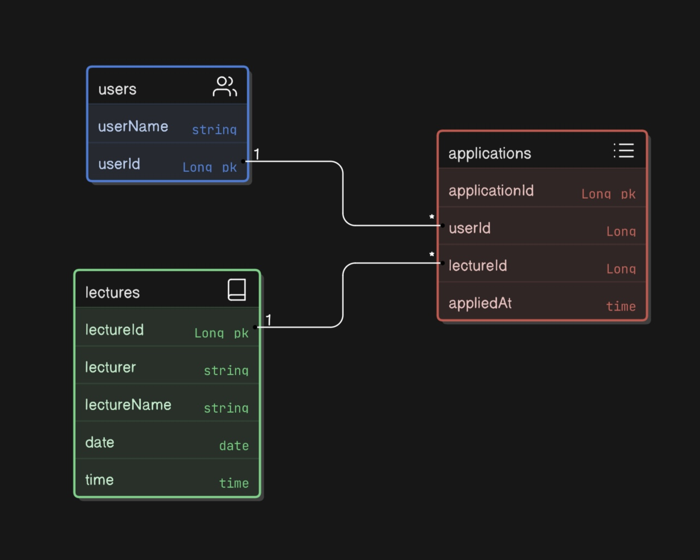

Users(Java에서는 User) 엔터티:

- userId:
    - 숫자, 그것도 소수점까지 표현이 되는 자료형을 식별자로 설정한 것에 대해 회사 선배님들의 거센 반발(?)이 있었고, 이 부분에 대해 설명하기 위해 스스로 연구를 좀 더 해보기도 했습니다. (지난주 차에는 그냥 초기에 과제에 VO에 ID 값의 자료형이 그렇게 설정이 되어있길래 별 생각이 없었다가… 선배님이 그때부터 의문을 제기하시고 “과제에 그렇게 설정이 되어있었다는 말로는 나를 설득할 수 없다.“라는 말씀에 좀 더 정신을 차리게 되었습니다^^;;; 이유없이 짠 코드는 용납이 안되는군요^_ㅠ) 결국은 성능만을 고려했을 때는 숫자로 처리하는게 가장 유리하고, 향후 배워갈 대규모 데이터 처리를 고려했을 때, 그대로 Long 으로 유지를 하는게 적절하다고 판단하여 Long으로 정해놓았습니다.
- userName:
    - 초기에는 사용자 편의성은 크게 고려 안하고 단지 기능 구현과 테스트를 목적으로 userId 필드만 추가했다가…
1. 회사 선배와 멘토링 피드백을 받을 때 모두 userId 필드만 넣어놓은 것에 모두 의아해하는 반응을 보이셨던 점
2. 그래도 사람이 신청을 하는 usecase를 고려해야 해서 이름 정도는 추가해야 하지 않을까… 싶은 생각에 추가했습니다.

Lectures(Java에서는 Lecture) 엔터티 :

- lectureId:
    - 여기도 userId 때와 같은 문제가 제기되었지만… 식별자는 모두 일관되게 Long으로 지정했습니다. 이게 업무 도메인에 따라 의견이 다를 수도 있다는 생각이 들기도 하는군요.
- lecturer:
    - 요구사항에 ‘토요일 특강‘을 신청하는 기능을 구현한다는 점에서 매주 토요일 우리가 예약하는 멘토링이 생각이 났구요, 멘토링을 신청하는 상황을 생각하면서 기능을 구현해보자는 취지로 필드에 강연자 이름을 추가했습니다.

    - lectureName:
      - 강의명도 조회해올 수 있게끔 해야 한다는 요구사항이 있어서 추가했습니다.

    - date:
      - ‘날짜별로’ 현재 신청 가능한 특강 목록을 조회하는 api를 작성하라는 내용이 요구사항에 있어서 추가했습니다.

    - time:
      - 토요일에 멘토링 신청하는 상황을 코드로 구현해보자는 생각으로 시작해보니, ’날짜‘ 필드가 있기 전에 ’시간‘ 필드가 있었습니다. 나중에 확인해보니 요구사항에는 없었지만, 있고 없고가 이번 과제에 크게 영향을 줄 것 같지는 않아 그대로 두기로 했습니다. 실제로 멘토링 신청을 할 때에도 ’날짜‘랑 ’시간‘이 모두 고려가 되고 있기도 합니다.

  Applications(Java에서는 Application):

    - applicationId:
      - 신청이 이루어질 때마다 Application레코드가 하나씩 생성이 되고, 저장할 때 각 레코드들을 구분지을 식별자가 필요하므로 추가한 필드입니다.
    - userId/lectureId(외래키):
      - Application 엔터티는 User엔터티와 Lecture엔터티를 연결지어주는 브릿지 테이블입니다. 사용자(user)가 신청한 강의(lecture) 정보를 가져오기 위해 두 엔터티의 식별자를 외래키로 추가했습니다.
      - 처음에는 조인 구문 없이 신청내역을 userId값만으로 불러올 생각에 Lecture 엔터티와 중복되는 필드들이 있었습니다. 그런데 조인이 많이 이루어지지도 않고, 지금 시점에는 중복된 정보를 굳이 두 테이블에 모두 담을 필요성을 못느꼈던 점에서, 중복되는 필드는 모두 뺐습니다.
    - appliedAt:

      특강 신청 정보가 DB에 입력되는 시점을 확인해보고자 추가한 필드입니다. 동시성 제어 테스트에 도움이 될거라 생각했습니다.